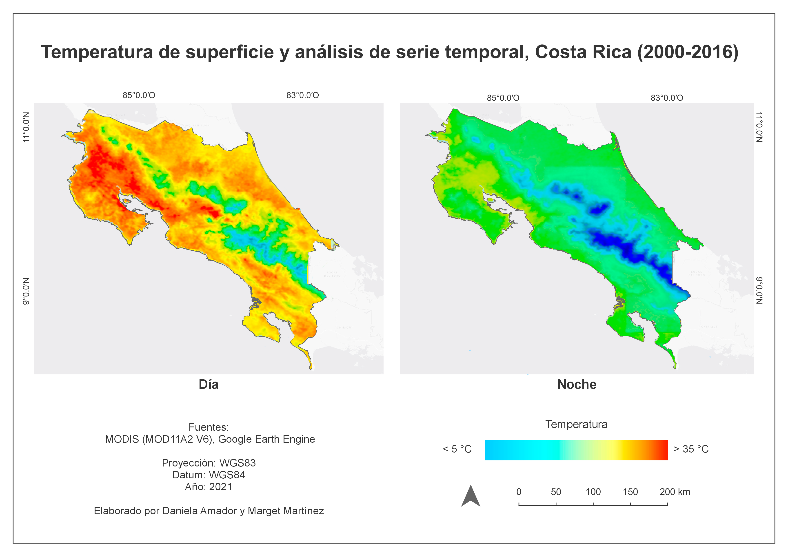
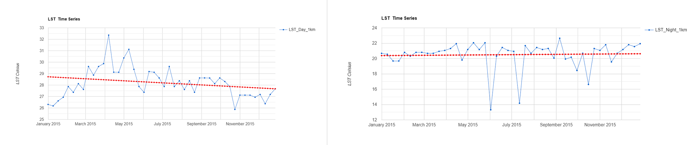
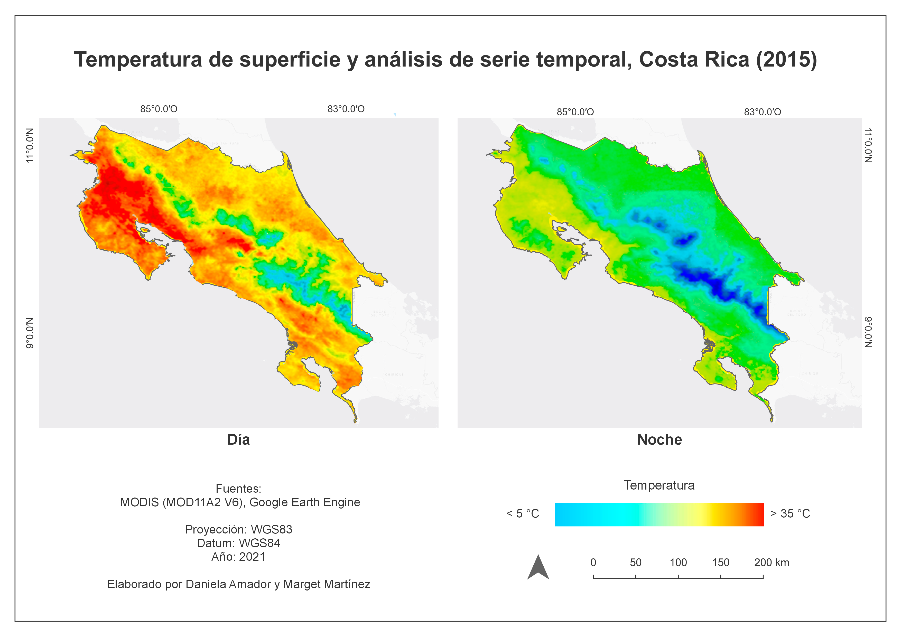
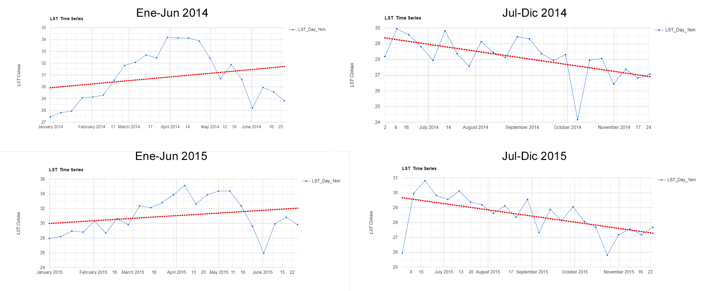

# Laboratorio 6

## Introducción

## Serie Temporal 2000-2016
### Gráficos

### Mapa

## Serie Temporal Enero-Diciembre 2015
### Gráficos

### Mapa

## Caso de Estudio: Sequía Región Chorotega (2014-2015)
### Gráficos

### Mapa

## Resultados
