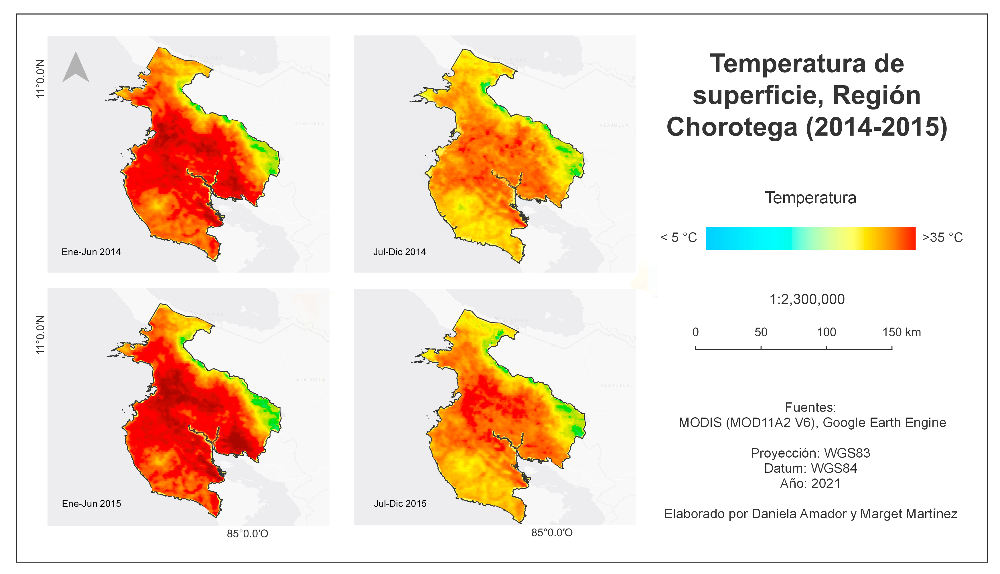

# Laboratorio 6

## Introducción

## Serie Temporal 2000-2016
### Gráficos

### Mapa

### Resultados y Análisis
1. Como se puede observar en gráficos y mapas, a través de Google Earth Engine se pueden manejar, representar y analizar grandes volúmenes de datos. Para este primer caso, se está representando una serie temporal de 16 años, lo que permite observar la variabilidad de los datos a lo largo de este periodo. 
2. En el primer gráfico (Temperatura de día), hay mucha variabilidad de datos. Estos van desde picos altos 32°C y un solo pico bajo de 21°C aproximadamente. La temperatura promedio es de 28°C. En el segundo gráfico (Temperatura de noche), la temperatura es más constante. Se mantiene entre 20°C. Se registran picos altos de 26°C y picos bajos de 10°C aproximadamente. 
2. En ambos mapas podemos ver cómo se distribuyó la temperatura de la superficie en este periodo. Se identifican dos patrones claros. Las altas temperaturas durante el día se registraron en la zona de Guanacaste principalmente. Mientras que las temperaturas más bajas se registraron en la cordillera de Talamanca. Durante la noche se repite este mismo patrón.  

## Serie Temporal Enero-Diciembre 2015
### Gráficos

### Mapa

### Resultados y Análisis
1. En esta serie temporal, al ser mucho menos datos que la serie anterior. Se puede ver con más detalle el comportamiento de la temperatura a lo largo de 12 meses. Por ejemplo, es más fácil identificar la época seca de la época lluviosa. 
2. En el primer gráfico (Temperatura de día), hay una mayor variabilidad. Los picos de temperatura se registran durante los meses de marzo, abril y mayo, llegando a 32°C aproximadamente. A partir de junio la temperatura desciende y en agosto hasta octubre es constante. Hasta que se llega a noviembre y se registra el pico más bajo de 26°C aproximadamente. 
3. El segundo gráfico (Temperatura de noche), prácticamente es constante durante todo el año, con excepción de tres picos bajos. El primero de 13°C (el más bajo de todos) registrado en junio, el segundo de 14°C registrado entre julio y agosto y el último de 17°C registrado entre octubre-noviembre. 
4. En los mapas, se observa cómo las temperaturas altas se distribuyen en las zonas bajas, principalmente en la provincia Guanacaste. Y las temperaturas bajas se distribuyen en las zonas altas como las cordilleras, principalmente en la cordillera de Talamanca. 

## Caso de Estudio: Sequía Región Chorotega (2014-2015)
### Gráficos

### Mapa

### Resultados y Análisis 

## Conclusiones
